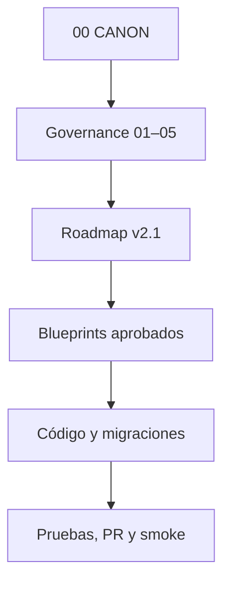
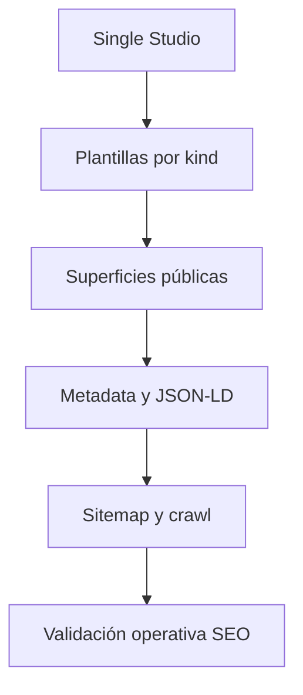

# 07 · BLUEPRINT DEPENDENCY MAP

**Estado:** Review Candidate
**Versión:** 1.0-rc1
**Última actualización:** 2026-07-20
**Autoridad:** mapa de trazabilidad; no crea dependencias ni autoriza ejecución.

## 1. Propósito

Relacionar autoridad, diseño, implementación, datos, pruebas y evidencia operativa. Una relación sólo se declara confirmada cuando existe en documentos, código, migraciones o historial verificable; las inferencias quedan marcadas.

## 2. Tipos de relación

| Relación | Lectura |
| --- | --- |
| governs | A establece reglas para B. |
| prioritizes | A determina el orden de B. |
| designs | A describe la intención de B. |
| implements | B materializa A. |
| persists-in | La capacidad usa el contrato o almacén indicado. |
| validates | Una prueba verifica una capacidad. |
| evidences | Un reporte/PR/smoke demuestra estado. |
| supersedes | A reemplaza la autoridad operativa de B sin borrarlo. |
| blocks | A debe resolverse antes de B. |
| defers | A mantiene B fuera del foco vigente. |

## 3. Cadena de autoridad

`06–08` indexan esta cadena; no se insertan por encima del roadmap ni cambian decisiones.

## 4. Secuencia vigente de producto y operación

| Origen | Relación | Destino | Estado de la relación |
| --- | --- | --- | --- |
| Roadmap v2.1 | prioritizes | CV8.9 | Cumplida; cerrado. |
| CV8.9 | blocks | AC1.4–AC1.5 | Cumplida; AC1 cerrado. |
| AC1.4–AC1.5 | blocks | Programa Fundadores | Cumplida técnicamente; falta GO operativo. |
| Plan `17.1` | designs | Programa Fundadores Valladolid | Confirmada; requiere oferta/responsable. |
| Programa Fundadores | blocks | Launch Operations Minimum | Abierta; mínimo 15, objetivo 25 empresas reales. |
| Launch Operations Minimum | blocks | Soft launch controlado | Abierta. |
| Datos reales + decisión Founder | blocks | CV7 o lanzamiento abierto | Condicionada. |
| Roadmap v2.1 | defers | MCP M1.1+, Header Builder, PWA total y nuevas capas | Activa. |

## 5. Trazabilidad de capacidades críticas

| Capacidad | Diseño | Implementación/almacén | Validación | Evidencia operativa |
| --- | --- | --- | --- | --- |
| Single Studio/plantillas | `15.10.4d-SINGLE-STUDIO-PRINCIPLE`, US-R3 | `src/components/experience-builder`, registries, compositions | typecheck/build/smokes de sub-olas | Completion Reports Ola 0–2.6b. |
| SEO metadata/schema | H1, SEO.A1 | `src/lib/discovery/seo.ts`, heads de rutas | SSR/build, matrices A1 | Completion Reports A1.1/A1.2. |
| Sitemap/crawl | H1/SEO certification | `sitemap.xml.ts`, `robots.txt`, `llms.txt` | respuestas públicas/inspección | SEO Launch Certification con condiciones. |
| Media | H3/A4 | media services, storage y resolvedores | benchmarks y fases M0–M2.3.1 | Completion Reports H3. |
| Travel Plan | CV0–CV6 | traveler contracts/functions y DB existente | suites CV, smokes | Completion/Closure Reports CV5/CV6. |
| Continuidad anónima | AC1 | IndexedDB/localStorage; importación autenticada | 1,000×20, idempotencia, browser smoke | PR #5–#7 y Completion Report AC1. |
| Action Queue | CV8.9 | ledger Visitor Intelligence + server functions | tests de decisión, DB smoke | PR #2–#4 y smoke Founder/Admin. |
| Empresas | Series 14/15, Trust/Profile | portal, CMS, business ownership y RLS | tests/smokes históricos | Roadmap: capacidad técnica cerrada; operación real pendiente. |
| Programa Fundadores | `17.1` | reutiliza empresas + proceso humano | checklist y smoke por empresa | Completion Report futuro. |

## 6. Dependencias de plantillas y SEO

- Cambiar una plantilla pública exige revisar head, canonical, JSON-LD, sitemap y no-regresión visual.
- Una auditoría anterior a un Completion Report no puede seguir bloqueando como si el código no existiera.
- La estrategia de dominio debe resolverse antes de cambios masivos de canonical o redirects.

## 7. Datos, seguridad y roles

| Capacidad | Datos/contrato | Regla de acceso | Condición pendiente |
| --- | --- | --- | --- |
| AC1 anónimo | `AnonymousTravelDraft` local | sólo dispositivo hasta autenticación | observación de segunda sesión real no bloqueante. |
| CV8.9 | ledger de eventos | Founder/Admin; assigned-only para operadores | smoke con Concierge Lead/Editor reales. |
| Empresas | businesses, ownership, contacts, catálogo | RLS y roles existentes | auditoría cruzada antes de una nueva exposición pública. |
| Cohorte fundadora | estado, responsable, consentimiento | registro restringido, no Blueprint público | definir ubicación operativa y responsable. |
| Simulación CV8.S | dataset determinístico | separado de producción | etiquetar origen en toda lectura operativa. |

## 8. Impacto mínimo por tipo de cambio

| Cambio | Revisar obligatoriamente |
| --- | --- |
| Gobernanza | CANON, documento rector, roadmap, `06–08`. |
| Blueprint nuevo | `05`, `06`, `07`, roadmap y decisión. |
| Plantilla pública | Single Studio, Surface Kit, rutas, SEO, smokes móvil/escritorio. |
| Ruta/slug/dominio | redirects, canonical, sitemap, JSON-LD, enlaces internos y GSC. |
| Tabla/RPC/RLS | principios, migración/rollback, permisos, tipos y tests. |
| Estado de cierre | Completion Report, PR/merge, despliegue, smoke, roadmap e índice. |

## 9. Relaciones inferidas pendientes de confirmación

- CV4 narrativo frente a capacidades comerciales construidas: requiere auditoría por contrato, no equivalencia nominal.
- Estados individuales de documentos históricos dentro de las 424 entradas: se preservan por familia hasta reconciliación específica.
- Dominio primario y activo SEO: requiere decisión canónica escrita antes de reconfiguración.

## 10. Control de versiones

| Versión | Fecha | Cambio |
| --- | --- | --- |
| 0.1 | 2026-07-20 | Reserva del mapa. |
| 1.0-rc1 | 2026-07-20 | Cadena de autoridad, roadmap, capacidades críticas, datos e impacto. |
