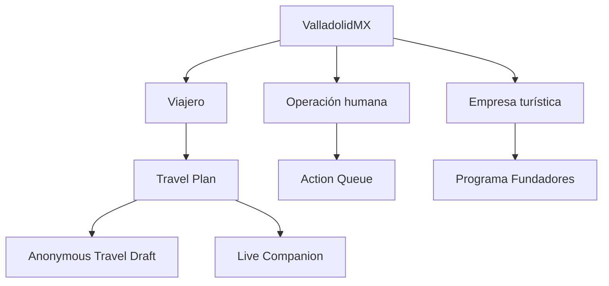
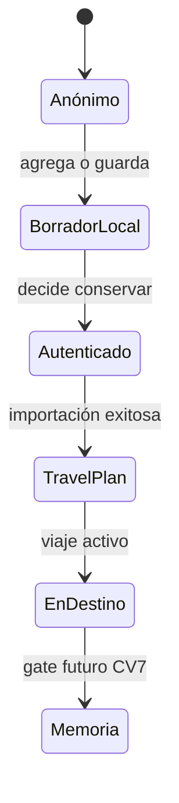
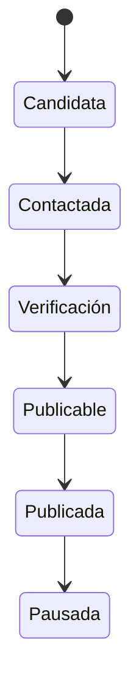
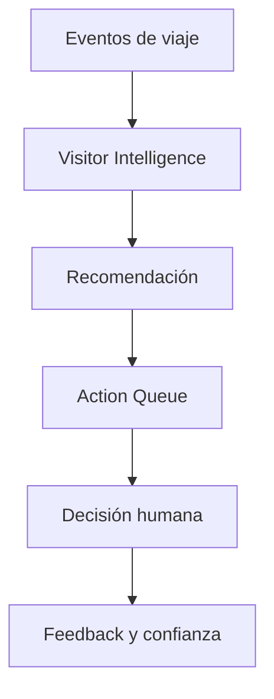

# 08 · KNOWLEDGE GRAPH

**Estado:** Review Candidate
**Versión:** 1.0-rc1
**Última actualización:** 2026-07-20
**Autoridad:** grafo de referencia; las definiciones pertenecen al GLOSSARY y documentos fuente.

## 1. Propósito

Conectar conceptos, actores, superficies, contratos y evidencia para que personas y agentes de IA puedan navegar el conocimiento sin redefinirlo. Este documento expresa relaciones; ante conflicto prevalece la fuente canónica enlazada.

## 2. Convenciones

| Prefijo | Tipo de nodo |
| --- | --- |
| `gov:` | gobernanza o decisión. |
| `doc:` | Blueprint, roadmap, reporte o guía. |
| `cap:` | capacidad del producto. |
| `actor:` | rol humano o sistema. |
| `surface:` | superficie pública u operativa. |
| `contract:` | contrato de datos o comportamiento. |
| `evidence:` | prueba, PR, despliegue o smoke. |
| `state:` | estado controlado del roadmap. |

Las aristas usan los verbos definidos en el mapa `07`.

## 3. Núcleo semántico

## 4. Entidades y fuentes

| Nodo | Significado referenciado | Fuente canónica |
| --- | --- | --- |
| `gov:canon` | identidad y principios permanentes | `00-CANON.md` |
| `gov:vocabulary` | términos oficiales | `01-GLOSSARY.md` |
| `gov:architecture` | principios técnicos | `02-ARCHITECTURAL-PRINCIPLES.md` |
| `gov:documentation` | ciclo documental | `03-DOCUMENTATION-STANDARD.md` |
| `gov:decision` | autoridad y decisiones | `04-DECISION-MAKING.md` |
| `gov:blueprint` | contrato previo a construcción | `05-BLUEPRINT-STANDARD.md` |
| `doc:roadmap` | orden vigente y gates | Roadmap v2.1 |
| `cap:single-studio` | editor visual único | Single Studio Principle + cierres US-R3 |
| `cap:seo` | metadata, entidades y crawl | H1 + SEO.A1–A3 |
| `cap:travel-plan` | workspace canónico del viaje | CV0–CV6 |
| `contract:anonymous-draft` | borrador local sin identidad | AC1 |
| `cap:visitor-intelligence` | señales y proyecciones de viaje | CV8.0–CV8.8 |
| `cap:action-queue` | decisión humana gobernada | CV8.9 |
| `cap:business-platform` | registro, reclamo, portal y publicación | Series 14/15 + Trust/Profile |
| `cap:founders-program` | primera cohorte real | Plan `17.1` |

## 5. Relaciones normativas principales

| Sujeto | Relación | Objeto |
| --- | --- | --- |
| `gov:canon` | governs | toda decisión, documento e implementación. |
| `gov:vocabulary` | names | conceptos del grafo. |
| `doc:roadmap` | prioritizes | capacidades activas y diferidas. |
| `cap:single-studio` | composes | plantillas y superficies administrables. |
| `cap:seo` | describes | entidades públicas sin sustituir contenido real. |
| `contract:anonymous-draft` | precedes | identidad autenticada. |
| `contract:anonymous-draft` | imports-into | `cap:travel-plan` tras éxito autenticado. |
| `cap:visitor-intelligence` | proposes-to | `cap:action-queue`. |
| `actor:founder` | approves | decisiones de alto impacto y gates. |
| `actor:admin` | operates | CMS, empresas y Action Queue dentro de permisos. |
| `actor:concierge-lead` | operates-assigned | decisiones y acompañamiento asignados. |
| `actor:editor` | edits-assigned | contenido permitido sin ampliar permisos. |
| `cap:business-platform` | enables | `cap:founders-program`. |
| `cap:founders-program` | produces | oferta real verificada para soft launch. |

## 6. Viaje e identidad

- El estado anónimo no crea una cuenta ni fila por interacción.
- La identidad se solicita en un momento de valor, no como gate genérico.
- CV7 permanece diferido hasta que el roadmap lo autorice.

## 7. Empresa y publicación

Los estados completos y criterios viven en `17.1`. Sólo empresas reales `Publicable` o `Publicada` cuentan para el gate; demos y seeds nunca cuentan.

## 8. Plantillas, contenido y SEO

| Sujeto | Relación | Objeto | Invariante |
| --- | --- | --- | --- |
| Single Studio | owns-editorial-path | plantillas oficiales | no existe editor paralelo. |
| Plantilla por kind | renders | múltiples registros por slug | no composición por registro sin decisión. |
| Superficie pública | emits | head/JSON-LD/canonical | deriva de datos reales y contrato SEO. |
| Cambio de slug | requires | redirect + sitemap | preservar contrato público estable. |
| Media | supplies | imagen y ALT | permisos y fuente verificables. |
| Dominio SEO | identifies | URL canónica | pendiente de decisión reconciliada. |

## 9. Inteligencia y acción humana

- Ninguna recomendación ejecuta cambios automáticamente.
- Simulación y producción conservan origen visible y separado.
- Assigned-only se valida con operadores reales cuando existan.

## 10. Estados documentales

| Estado | Relación permitida |
| --- | --- |
| Draft/Proposed | puede informar; no autoriza código. |
| Approved | autoriza la siguiente etapa definida, no el merge o despliegue implícito. |
| Cierre técnico | evidencia código; conserva gates externos pendientes. |
| Cerrado | evidencia y aprobaciones requeridas presentes. |
| Operativo pendiente | capacidad existente sin prueba/configuración real suficiente. |
| Diferido | fuera del foco hasta señal o decisión. |
| Historical | preservado, sin prioridad vigente. |

## 11. Consultas de navegación recomendadas

- “¿Qué gobierna esta capacidad?” → `06` → fuente §4 → gobernanza `00–05`.
- “¿Qué depende de este cambio?” → `07` §§5–8.
- “¿Está construido?” → código + Completion Report; nunca sólo el Blueprint.
- “¿Está en producción?” → merge + deployment + smoke.
- “¿Qué sigue?” → roadmap v2.1 + `.lovable/plan.md`.
- “¿Puede Alux asumirlo?” → sólo si la relación y fuente están registradas; nunca inferir datos reales.

## 12. Control de versiones

| Versión | Fecha | Cambio |
| --- | --- | --- |
| 0.1 | 2026-07-20 | Reserva del grafo. |
| 1.0-rc1 | 2026-07-20 | Núcleo semántico, actores, estados y relaciones de capacidades vigentes. |
